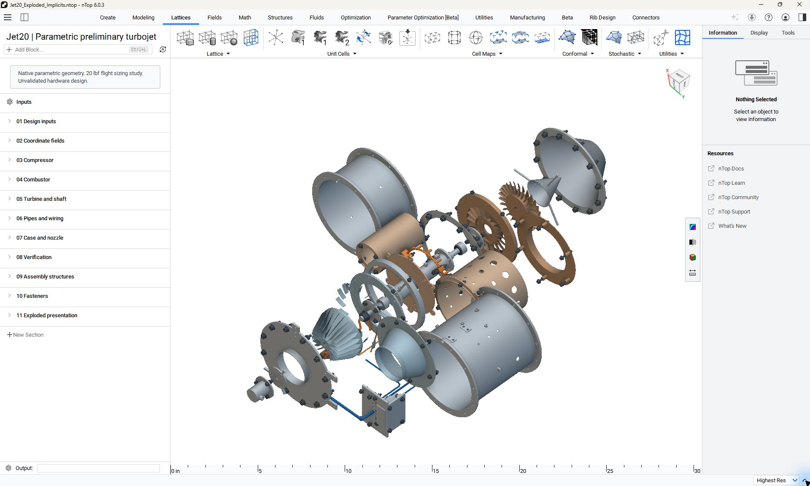

# Native nTop assembly screenshots

These are genuine, unedited nTop application captures recorded on 9 September 2026.
They retain the application UI. They are not browser renders or composited interfaces.

The exploded view uses the native implicit bodies. The offsets illustrate part relationships;
they do not establish a feasible assembly sequence or installation clearance.
The related [assembled notebook](../models/Jet20_Assembled.ntop) and
[exploded notebook](../models/Jet20_Exploded_Implicits.ntop) are included.
[Capture hashes and application version](capture_manifest.json) identify the recorded snapshots.
The images were visually reviewed for personal paths and private log text before publication.
